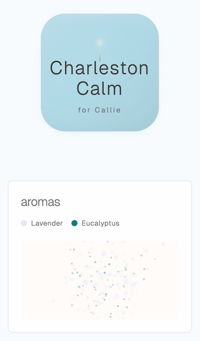

# ThisGiftIsForYou

A personalized gift experience that allows users to create, share, and provide feedback on custom [YOUR_GIFT_ITEM]. Visit [yourgiftsite.com](https://yourgiftsite.com) to create your own.

## Features

- Create personalized [YOUR_GIFT_ITEM] with custom [CUSTOMIZATIONS] and colors
- Interactive [CUSTOMIZATION] visualization
- Detailed [CUSTOMIZATION] profiles and recommendations
- Shareable gift pages with QR codes




## Gift Item Fields

Required fields for creating a [YOUR_GIFT_ITEM]:
- `name` (text): Name of the [YOUR_GIFT_ITEM]
- `recipient_name` (text): Name of the person the [YOUR_GIFT_ITEM] is for
- `color` (text): Hex color code (e.g., '#FFE4B5')
- `customizations` (jsonb): Array of customization objects, each containing:
  ```typescript
  {
    name: string,        // Name of the customization
    description: string, // Description of the customization
    intensity: number,   // Value between 0 and 1
    color: string       // Hex color code for the customization
  }
  ```

Optional fields:
- `description` (text): Description of the [YOUR_GIFT_ITEM]'s benefits
- `recommended_uses` (text[]): Array of recommended use cases

## Bulk Adding Gift Items

You can add gift items directly in Supabase's SQL editor using this query:

```sql
INSERT INTO gift_items (name, recipient_name, color, customizations)
VALUES
  (
    'Ocean Theme',
    'Sarah',
    '#87CEEB',
    '[
      {"name": "Wave Pattern", "description": "Flowing ocean waves", "intensity": 0.7, "color": "#B0E0E6"},
      {"name": "Shell Accent", "description": "Delicate shell design", "intensity": 0.3, "color": "#FDFAF3"}
    ]'::jsonb
  ),
  (
    'Forest Theme',
    'Michael',
    '#228B22',
    '[
      {"name": "Leaf Pattern", "description": "Detailed leaf design", "intensity": 0.8, "color": "#2E8B57"},
      {"name": "Wood Grain", "description": "Natural wood texture", "intensity": 0.6, "color": "#8B4513"},
      {"name": "Moss Accent", "description": "Subtle moss texture", "intensity": 0.4, "color": "#90EE90"}
    ]'::jsonb
  );
```

Example with all optional fields:
```sql
INSERT INTO gift_items (
  name, 
  recipient_name, 
  color, 
  customizations, 
  description, 
  recommended_uses
)
VALUES (
  'Lavender Dream',
  'Emma',
  '#E6E6FA',
  '[
    {"name": "Lavender Pattern", "description": "Calming lavender design", "intensity": 0.6, "color": "#E6E6FA"},
    {"name": "Vanilla Swirl", "description": "Sweet comfort pattern", "intensity": 0.3, "color": "#F3E5AB"}
  ]'::jsonb,
  'Promotes relaxation and comfort',
  ARRAY['Daily Use', 'Gift Giving', 'Special Occasions']
);
```

## Environment Variables

Required environment variables:
```bash
NEXT_PUBLIC_SUPABASE_URL=your_supabase_url
NEXT_PUBLIC_SUPABASE_ANON_KEY=your_supabase_anon_key
NEXT_PUBLIC_SITE_URL=https://yourgiftsite.com
```

## Development

```bash
# Install dependencies
npm install

# Run development server
npm run dev

# Build for production
npm run build

# Generate QR codes for all gift items
npm run generate-qr
```

## Deployment

This application is designed to be deployed on Vercel or any other Next.js-compatible hosting platform.

## Technologies Used

- Next.js
- TypeScript
- Tailwind CSS
- Supabase (PostgreSQL)
- QR Code generation

## License

[MIT](LICENSE) 