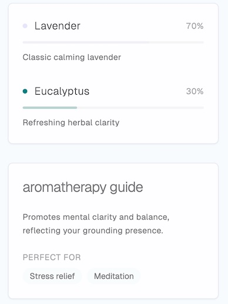

# ThisCandleIsForYou

A personalized candle experience that allows users to create, share, and provide feedback on custom candles. Visit [thiscandleisforyou.com](https://thiscandleisforyou.com) to create your own.

## Features

- Create personalized candles with custom scents and colors
- Interactive aroma visualization
- Detailed scent profiles and aromatherapy recommendations
- Shareable candle pages with QR codes




## Candle Fields

Required fields for creating a candle:
- `name` (text): Name of the candle
- `recipient_name` (text): Name of the person the candle is for
- `color` (text): Hex color code (e.g., '#FFE4B5')
- `scents` (jsonb): Array of scent objects, each containing:
  ```typescript
  {
    name: string,        // Name of the scent
    description: string, // Description of the scent
    intensity: number,   // Value between 0 and 1
    color: string       // Hex color code for the scent
  }
  ```

Optional fields:
- `aromatherapy_description` (text): Description of aromatherapy benefits
- `recommended_uses` (text[]): Array of recommended use cases

## Bulk Adding Candles

You can add candles directly in Supabase's SQL editor using this query:

```sql
INSERT INTO candles (name, recipient_name, color, scents)
VALUES
  (
    'Ocean Breeze',
    'Sarah',
    '#87CEEB',
    '[
      {"name": "Sea Salt", "description": "Fresh ocean air", "intensity": 0.7, "color": "#B0E0E6"},
      {"name": "Coconut", "description": "Tropical sweetness", "intensity": 0.3, "color": "#FDFAF3"}
    ]'::jsonb
  ),
  (
    'Forest Walk',
    'Michael',
    '#228B22',
    '[
      {"name": "Pine", "description": "Fresh pine needles", "intensity": 0.8, "color": "#2E8B57"},
      {"name": "Cedar", "description": "Woody warmth", "intensity": 0.6, "color": "#8B4513"},
      {"name": "Moss", "description": "Forest floor", "intensity": 0.4, "color": "#90EE90"}
    ]'::jsonb
  );
```

Example with all optional fields:
```sql
INSERT INTO candles (
  name, 
  recipient_name, 
  color, 
  scents, 
  aromatherapy_description, 
  recommended_uses
)
VALUES (
  'Lavender Dreams',
  'Emma',
  '#E6E6FA',
  '[
    {"name": "Lavender", "description": "Calming French lavender", "intensity": 0.6, "color": "#E6E6FA"},
    {"name": "Vanilla", "description": "Sweet comfort", "intensity": 0.3, "color": "#F3E5AB"}
  ]'::jsonb,
  'Promotes relaxation and better sleep',
  ARRAY['Bedtime', 'Meditation', 'Stress Relief']
);
```

## Environment Variables

Required environment variables:
```bash
NEXT_PUBLIC_SUPABASE_URL=your_supabase_url
NEXT_PUBLIC_SUPABASE_ANON_KEY=your_supabase_anon_key
NEXT_PUBLIC_SITE_URL=https://thiscandleisforyou.com
```
